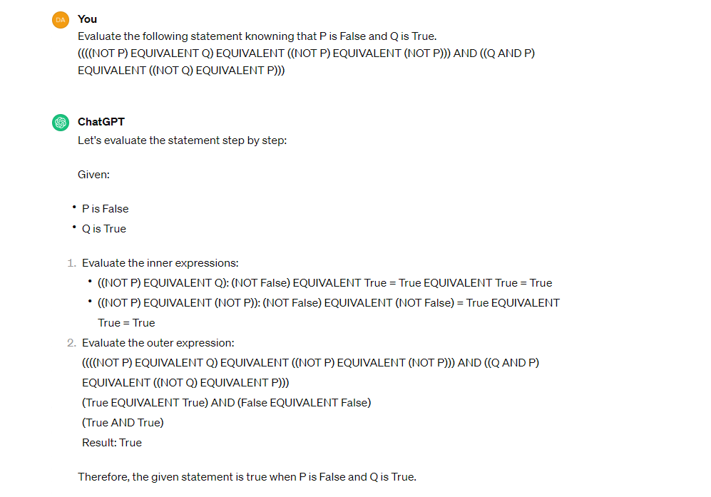

# Exploring Logical Reasoning in Large Language Models (LLMs)

## Introduction
Large Language Models (LLMs) have achieved remarkable results in natural language tasks such as language translation, text summarization, and question answering. Despite this, a critical question remains: can LLMs truly understand logical statements?

Logic is fundamental to reasoning and is widely used across fields like mathematics, computer science, and philosophy. Logical statements are constructed using propositions and connectives such as AND, OR, NOT, IMPLIES, and EQUIVALENT, allowing complex relationships between propositions to be represented. True comprehension of these statements requires interpreting these logical connectives accurately and deriving valid conclusions based on formal principles.

This project aims to explore the logical reasoning capabilities of LLMs. Specifically, we tested ChatGPT and fine-tuned LLama2, an open-source LLM, to determine how well they handle logical thinking.

## Logical Statements Used
Below are examples of logical statements used in our testing, with the assumptions that \( P \) is True and \( Q \) is False:

- \(((P \text{ EQUIVALENT } Q) \text{ EQUIVALENT } ((\text{NOT } Q) \text{ EQUIVALENT } (\text{NOT } P))) \text{ AND } ((Q \text{ EQUIVALENT } (\text{NOT } P)) \text{ OR } ((\text{NOT } Q) \text{ EQUIVALENT } (\text{NOT } P)))\)
- \(((P \text{ EQUIVALENT } P) \text{ AND } (Q \text{ EQUIVALENT } (\text{NOT } P))) \text{ OR } ((P \text{ OR } (\text{NOT } P)) \text{ EQUIVALENT } (P \text{ EQUIVALENT } Q))\)
- \(((P \text{ EQUIVALENT } P) \text{ EQUIVALENT } (Q \text{ OR } P)) \text{ OR } (((\text{NOT } Q) \text{ EQUIVALENT } Q) \text{ OR } (Q \text{ EQUIVALENT } (\text{NOT } Q)))\)

## Results
Our experiments showed that ChatGPT (GPT-3.5) provided incorrect answers for approximately 50% of the logical statements tested, suggesting a random response pattern. When accounting for all the logical steps leading to the conclusion, the accuracy dropped to 30% (see Figure 1 in the report for a specific example of ChatGPT's error). However, fine-tuning Llama2 (7B parameter version) with logical statements significantly improved performance, achieving 100% accuracy on the test set. These results suggest that LLMs' logical reasoning capabilities can be enhanced through targeted fine-tuning.

## Repository Structure
- `scripts/`: Includes the script for generating logical statements and the script for fine-tuning LLama2 on logical tasks, downloading the fine-tuned model, and evaluating it.